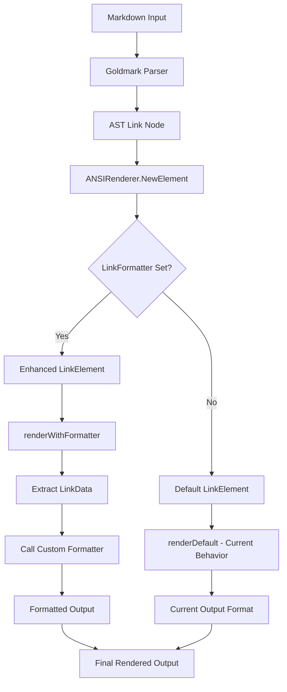

# Custom Link Formatting Architecture for Glamour

## Overview

This document outlines the architecture for adding custom link formatting capabilities to the Glamour markdown rendering library. The design enables users to provide custom formatting functions for links while maintaining complete backward compatibility.

## Current State Analysis

### Existing Link Rendering
- **Location**: [`ansi/link.go`](ansi/link.go) - `LinkElement.Render()`
- **Current Format**: `text url` (text followed by space and URL)
- **Processing**: [`ansi/elements.go`](ansi/elements.go:222-300) creates `LinkElement` instances
- **Integration**: [`ansi/renderer.go`](ansi/renderer.go:93-139) processes AST nodes

### Extension Points Identified
1. `LinkElement.Render()` method - main customization point
2. `Options` struct - can hold formatter configuration  
3. `TermRendererOption` pattern - for user configuration
4. Element creation in `NewElement()` - where formatter gets applied

## Architecture Design

### Core Data Structures

#### LinkData
```go
// LinkData contains all parsed link information available to formatters
type LinkData struct {
    // Basic link properties
    URL         string                 // The destination URL
    Text        string                 // The link text (extracted from children)
    Title       string                 // Optional title attribute
    BaseURL     string                 // Base URL for relative link resolution
    
    // Formatting context
    IsAutoLink  bool                   // Whether this is an autolink
    IsInTable   bool                   // Whether link appears in a table
    Children    []ElementRenderer      // Original child elements for advanced rendering
    
    // Style context
    LinkStyle   StylePrimitive         // Style for the URL portion
    TextStyle   StylePrimitive         // Style for the text portion
}
```

#### LinkFormatter Interface
```go
// LinkFormatter defines how links should be rendered
type LinkFormatter interface {
    FormatLink(data LinkData, ctx RenderContext) (string, error)
}

// LinkFormatterFunc allows functions to implement LinkFormatter
type LinkFormatterFunc func(LinkData, RenderContext) (string, error)
func (f LinkFormatterFunc) FormatLink(data LinkData, ctx RenderContext) (string, error)
```

### Configuration System

#### Extended Options
```go
type Options struct {
    // Existing fields (unchanged)
    BaseURL          string
    WordWrap         int
    TableWrap        *bool
    InlineTableLinks bool
    PreserveNewLines bool
    ColorProfile     termenv.Profile
    Styles           StyleConfig
    ChromaFormatter  string
    
    // New: Custom link formatter (nil = default behavior)
    LinkFormatter    LinkFormatter
}
```

#### TermRendererOptions
```go
// WithLinkFormatter sets a custom link formatter
func WithLinkFormatter(formatter LinkFormatter) TermRendererOption

// Convenience methods
func WithTextOnlyLinks() TermRendererOption      // Show only clickable text
func WithURLOnlyLinks() TermRendererOption       // Show only URLs  
func WithHyperlinks() TermRendererOption         // Enable OSC 8 hyperlinks
func WithSmartHyperlinks() TermRendererOption    // OSC 8 with fallback
```

## Implementation Plan

### 1. Core Infrastructure Changes

#### A. Update LinkElement Structure
**File**: `ansi/link.go`
```go
type LinkElement struct {
    // Existing fields (unchanged)
    BaseURL     string
    URL         string
    Children    []ElementRenderer
    SkipText    bool
    SkipHref    bool
    
    // New fields
    Title       string            // Optional title attribute
    Formatter   LinkFormatter     // nil = use default behavior
    IsAutoLink  bool             // Track autolink status
    IsInTable   bool             // Track table context
}
```

#### B. Modify Render Method
**File**: `ansi/link.go`
```go
func (e *LinkElement) Render(w io.Writer, ctx RenderContext) error {
    if e.Formatter != nil {
        return e.renderWithFormatter(w, ctx)
    }
    // Preserve existing behavior exactly
    return e.renderDefault(w, ctx)
}

func (e *LinkElement) renderWithFormatter(w io.Writer, ctx RenderContext) error {
    // Extract text, create LinkData, call formatter
}

func (e *LinkElement) renderDefault(w io.Writer, ctx RenderContext) error {
    // Move existing implementation here (unchanged)
}
```

#### C. Update Element Creation
**File**: `ansi/elements.go`
```go
case ast.KindLink:
    n := node.(*ast.Link)
    // ... existing logic ...
    
    return Element{
        Renderer: &LinkElement{
            BaseURL:     ctx.options.BaseURL,
            URL:         string(n.Destination),
            Title:       string(n.Title),          // Add title
            Children:    children,
            SkipHref:    isFooterLinks,
            Formatter:   ctx.options.LinkFormatter, // Add formatter
            IsAutoLink:  false,                     // Track type
            IsInTable:   isFooterLinks,            // Track context
        },
    }
```

### 2. Built-in Formatters

#### Default Formatter
```go
var DefaultFormatter = LinkFormatterFunc(func(data LinkData, ctx RenderContext) (string, error) {
    // Exactly replicate current behavior: "text url"
})
```

#### Text-Only Formatter
```go
var TextOnlyFormatter = LinkFormatterFunc(func(data LinkData, ctx RenderContext) (string, error) {
    if supportsHyperlinks(ctx) {
        return formatHyperlink(styledText, data.URL), nil
    }
    return applyStyle(data.Text, data.TextStyle, ctx), nil
})
```

#### URL-Only Formatter
```go
var URLOnlyFormatter = LinkFormatterFunc(func(data LinkData, ctx RenderContext) (string, error) {
    return applyStyle(data.URL, data.LinkStyle, ctx), nil
})
```

#### Hyperlink Formatter (OSC 8)
```go
var HyperlinkFormatter = LinkFormatterFunc(func(data LinkData, ctx RenderContext) (string, error) {
    styledText := applyStyle(data.Text, data.TextStyle, ctx)
    return formatHyperlink(styledText, data.URL), nil
})
```

### 3. Modern Terminal Support

#### OSC 8 Hyperlink Implementation
```go
const (
    HyperlinkStart = "\x1b]8;;"     
    HyperlinkMid   = "\x1b\\"       
    HyperlinkEnd   = "\x1b]8;;\x1b\\"
)

func formatHyperlink(text, url string) string {
    return fmt.Sprintf("%s%s%s%s%s", HyperlinkStart, url, HyperlinkMid, text, HyperlinkEnd)
}
```

#### Terminal Detection
```go
func supportsHyperlinks(ctx RenderContext) bool {
    term := os.Getenv("TERM")
    termProgram := os.Getenv("TERM_PROGRAM")
    
    supportingTerminals := map[string]bool{
        "iTerm.app":          true,  // iTerm2
        "vscode":             true,  // VS Code terminal
        "Windows Terminal":   true,  // Windows Terminal
        "WezTerm":           true,   // WezTerm
    }
    
    return supportingTerminals[termProgram] || 
           strings.Contains(term, "256color") || 
           strings.Contains(term, "truecolor")
}
```

## Usage Examples

### Basic Usage (No Changes Required)
```go
// Existing code works unchanged
r, _ := glamour.NewTermRenderer(glamour.WithStandardStyle("dark"))
out, _ := r.Render(markdown)
```

### Built-in Formatters
```go
// Text-only links (clickable in smart terminals)
r, _ := glamour.NewTermRenderer(
    glamour.WithStandardStyle("dark"),
    glamour.WithTextOnlyLinks(),
)

// Hyperlinks with fallback
r, _ := glamour.NewTermRenderer(
    glamour.WithStandardStyle("dark"),
    glamour.WithSmartHyperlinks(),
)
```

### Custom Formatters
```go
// Markdown-style formatting
markdownFormatter := glamour.LinkFormatterFunc(func(data glamour.LinkData, ctx glamour.RenderContext) (string, error) {
    return fmt.Sprintf("[%s](%s)", data.Text, data.URL), nil
})

r, _ := glamour.NewTermRenderer(
    glamour.WithStandardStyle("dark"),
    glamour.WithLinkFormatter(markdownFormatter),
)

// Conditional formatting based on context
smartFormatter := glamour.LinkFormatterFunc(func(data glamour.LinkData, ctx glamour.RenderContext) (string, error) {
    if data.IsInTable {
        return data.Text, nil  // Tables: text only
    }
    if supportsHyperlinks(ctx) {
        return formatHyperlink(data.Text, data.URL), nil  // Modern terminals: hyperlinks
    }
    return fmt.Sprintf("%s (%s)", data.Text, data.URL), nil  // Fallback: text (url)
})
```

## Backward Compatibility Guarantees

1. **Zero Breaking Changes**: All existing code continues to work unchanged
2. **Performance**: No overhead for existing users (fast path when `LinkFormatter` is nil)
3. **Output**: Default behavior produces identical output to current implementation
4. **API**: All existing `TermRendererOption` functions work unchanged
5. **Configuration**: All existing style configurations remain valid
6. **Testing**: All existing golden test files produce identical results

## Migration Strategy

### Phase 1: Internal Changes Only
- Implement new architecture with default behavior
- All existing tests pass
- No user-visible changes

### Phase 2: Built-in Formatters
- Add convenience `TermRendererOption` functions
- Users can opt into new functionality
- Documentation shows new possibilities

### Phase 3: Advanced Features
- Custom formatter documentation and examples
- Community-contributed formatters
- Advanced use cases and best practices

## Testing Strategy

### Unit Tests
1. **LinkFormatter Interface Tests**
   - Test all built-in formatters
   - Test custom formatter integration
   - Test error handling

2. **Integration Tests**
   - Test formatter configuration through TermRendererOptions
   - Test various markdown link types (regular, autolinks, titles)
   - Test table context handling

3. **Regression Tests**
   - All existing golden files must pass unchanged
   - Performance benchmarks maintain current levels

4. **Hyperlink Tests**
   - OSC 8 sequence generation
   - Terminal detection logic
   - Fallback behavior

### Test Examples
```go
func TestCustomLinkFormatter(t *testing.T) {
    formatter := LinkFormatterFunc(func(data LinkData, ctx RenderContext) (string, error) {
        return fmt.Sprintf("CUSTOM[%s](%s)", data.Text, data.URL), nil
    })
    
    r, _ := NewTermRenderer(
        WithStandardStyle("dark"),
        WithLinkFormatter(formatter),
    )
    
    result, _ := r.Render("[example](https://example.com)")
    assert.Contains(t, result, "CUSTOM[example](https://example.com)")
}

func TestHyperlinkSupport(t *testing.T) {
    // Test OSC 8 sequence generation
    result := formatHyperlink("example", "https://example.com")
    expected := "\x1b]8;;https://example.com\x1b\\example\x1b]8;;\x1b\\"
    assert.Equal(t, expected, result)
}
```

## File Structure Changes

### New Files
- `ansi/link_formatter.go` - LinkFormatter interface and built-in formatters
- `ansi/hyperlink.go` - OSC 8 hyperlink implementation and terminal detection

### Modified Files
- `ansi/renderer.go` - Add LinkFormatter to Options struct
- `ansi/link.go` - Update LinkElement and Render method
- `ansi/elements.go` - Update link element creation
- `glamour.go` - Add new TermRendererOption functions

### Documentation Updates
- `README.md` - Add custom link formatting examples
- `examples/` - Add new example demonstrating custom formatters
- Code comments throughout for new functionality

## Implementation Mermaid Diagrams



```mermaid
graph LR
    A[User Code] --> B[WithLinkFormatter]
    B --> C[TermRenderer Options]
    C --> D[ANSIRenderer Options]
    D --> E[LinkElement Creation]
    E --> F{Custom Formatter?}
    F -->|Yes| G[renderWithFormatter]
    F -->|No| H[renderDefault]
    G --> I[LinkData Creation]
    I --> J[Formatter.FormatLink]
    J --> K[Custom Output]
    H --> L[Default: "text url"]
```

This architecture provides a clean, extensible solution that maintains complete backward compatibility while enabling powerful new link formatting capabilities.